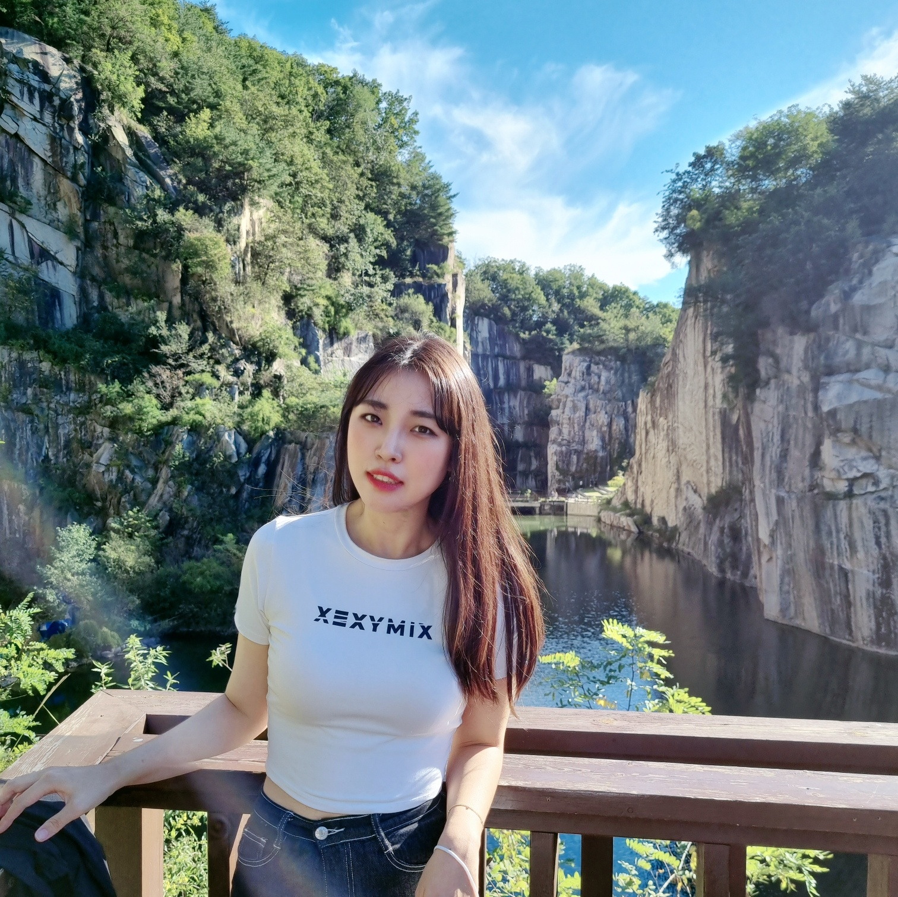

# 신보경 포트폴리오

 

## :pushpin: Intro
</img>

 

## :pushpin: Contact
- 이메일: bboya930518@gmail.com
- 블로그: 
- 깃헙: https://github.com/nanazzoo

 

## :pushpin: Projects
### 1. [goQuality](https://github.com/Integerous/goQuality)
>고퀄리티 개발 컨텐츠 공유 서비스 (개인 프로젝트)  
>개발 기간: 2019.2.18 ~ 2019.4.5  
>  
>기술 스택:  
>Java11 / Spring / Maven / Spring Data JPA / Oracle
> / Spring Security / Javascript 
>  
>[프로젝트 상세 설명]

---

### 2. [Fiesta]()
>SNS(Instagram) 클론 팀프로젝트 
>개발 기간: 2022.10.18 ~ 2022.12.8  
>  
>기술 스택:  
>Java 8 / Spring Boot / Gradle / Spring Data JPA / QueryDSL  
>H2 / MySQL / Spring Security / Jsoup / Vue.js / Element U  
>  
>[프로젝트 상세 설명]

---

### 3. [세 번째 프로젝트]()
>세 번째 프로젝트 간략 소개  (개인 프로젝트)  
>개발 기간: 2018.1.18 ~ 2018.4.5  
>  
>기술 스택:  
>Java 8 / Spring Boot / Gradle / Spring Data JPA / QueryDSL  
>H2 / MySQL / Spring Security / Jsoup / Vue.js / Element U  
>  
>[프로젝트 상세 설명](https://github.com/Integerous/goQuality) 참고
